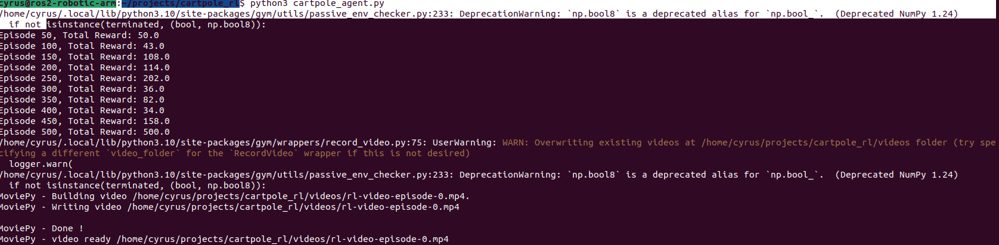

# CartPole Reinforcement Learning Agent

This project builds and trains a reinforcement learning (RL) agent using PyTorch and OpenAI Gym to solve the CartPole balancing task. The goal: keep a pole balanced upright by moving a cart left or right.

---

## 🚀 What the Project Does

- Trains an RL agent using the **REINFORCE** algorithm (policy gradients)
- Uses a neural network to decide which action to take based on the current game state
- Learns by trial and error — gets a reward for each step the pole remains balanced
- Achieves a perfect score (500) within 500 episodes of training

---

## ⚙️ How It Works

- **Environment**: `CartPole-v1` from OpenAI Gym simulates the physics
- **Policy Network**: 2-layer fully connected neural net (PyTorch) outputs action probabilities
- **Training Loop**: Uses log probabilities and discounted rewards to update the network
- **Optimizer**: Adam with a learning rate of 0.01
- **Episode Count**: 500 training episodes, with score printed every 50

---

## 💥 What We Attempted

- We **implemented video recording** using `gym.wrappers.RecordVideo` to save an `.mp4` of the trained agent.
- We **successfully executed** the video recording code — no runtime errors.
- However, **no usable video was produced inside the VM**.

---

## ⚠️ Why the Video Didn’t Work

This project was run inside **Ubuntu running in a VMware Workstation virtual machine**. While the code includes proper video saving logic using `render_mode="rgb_array"` + MoviePy, the VM environment:

- Has **no GPU passthrough or hardware acceleration**
- Lacks **OpenGL or native rendering support**
- Can “record” but outputs a black or unreadable video

---

## ✅ When the Video *Will* Work

Video rendering is likely to work **only** when:
- Run on **bare-metal Linux** (not a VM)
- Or on **Windows/Mac** with full Python + pygame + MoviePy support
- Or if using **Google Colab + upload/download workaround**

---

## 📸 What We Showed Instead

Because video didn’t render, we captured a **real terminal output** showing:
- The agent training to a perfect score (`500`)
- Confirmation that the video recording logic executed
- Screenshot of that output is included below 👇



---

## 👩‍🦳 Grandma vs. 🧠 Tech Snob Explanation

**👵 Grandma Version:**
> I built a little robot brain that learned how to keep a stick balanced by itself — kind of like a toddler learning to balance a broom. It failed a lot at first, but over time, it got really good. In the end, it was perfect.

**🤓 Tech Snob Version:**
> Implemented a stochastic policy gradient agent using REINFORCE to solve the CartPole-v1 environment via PyTorch. The agent learns a probability distribution over actions using a softmax-activated MLP and optimizes via discounted cumulative rewards and log-likelihood loss. Reaches convergence within 500 episodes.

---

## 📦 Requirements

```bash
pip install torch gym numpy pygame moviepy
